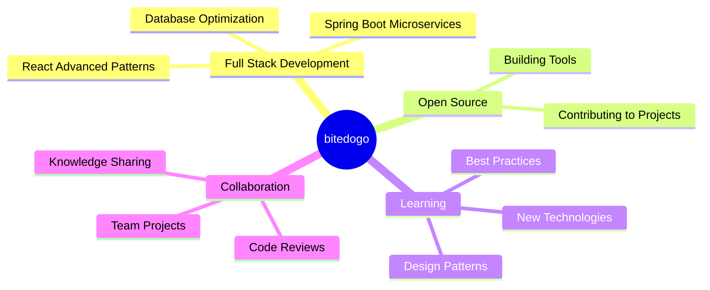

# 👋 Hi, I'm bitedogo

 

 

## 🚀 About Me

 

**📍 Location:** Seoul, South Korea 🇰🇷

**💼 Role:** Full Stack Developer

**💻 Languages:** JavaScript, Java, Dart

**🎯 Focus:** Building scalable web applications

**✨ Passion:** Turning ideas into reality through code

 

## 🛠️ Technology Stack

### 💻 Languages

### ⚛️ Frontend Development

### 🔧 Backend & Database

### 🛠️ Tools & Platform

 

## 📊 GitHub Analytics

 

 

 

 

## 🎯 Featured Projects

 

<table>
<tr>
<td width="50%" valign="top">

### 🐱 JavaNyang

**실시간 자바 퀴즈 대전 플랫폼**

 

실시간 대결과 랭킹 시스템을 통해 학습 동기를 부여하는 인터랙티브 학습 플랫폼입니다.

 

**🛠 Tech Stack**

**✨ Key Features**

- 🎮 WebSocket 기반 실시간 1:1 퀴즈 대전
- 💬 실시간 채팅 시스템 구현
- 📊 난이도별 자동 경험치 부여
- 🏆 업적 및 랭킹 시스템
- ⚙️ 관리자 대시보드 (회원/문제 관리)
- 💾 효율적인 DB 설계 및 최적화

**👨‍💻 Role:** Team Leader, Frontend & DB

**📅 Duration:** 2 months (2025.05 - 2025.07)

 

</td>
<td width="50%" valign="top">

### 📚 Studyo

**스터디 그룹 모집 플랫폼**

 

모집부터 활동까지 원스톱으로 지원하는 통합 협업 플랫폼입니다.

 

**🛠 Tech Stack**

**✨ Key Features**

- 👤 직관적인 마이페이지 UI/UX
- 🎨 재사용 가능한 모달 컴포넌트
- 📅 그룹 스케줄 캘린더
- 🔔 실시간 알림 시스템
- ☁️ AWS 기반 안정적인 배포
- 🔗 RESTful API 설계

**👨‍💻 Role:** Frontend & Backend Developer

**📅 Duration:** 1 month (2025.07 - 2025.08)

 

</td>
</tr>
</table>

 

 

## 💼 Current Focus

 

## 🤝 Let's Connect

 

### 💭 Developer Quote

 

---

**Thanks for visiting my profile! 😊**

